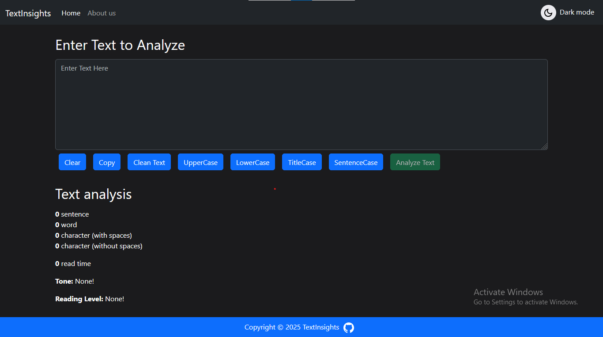
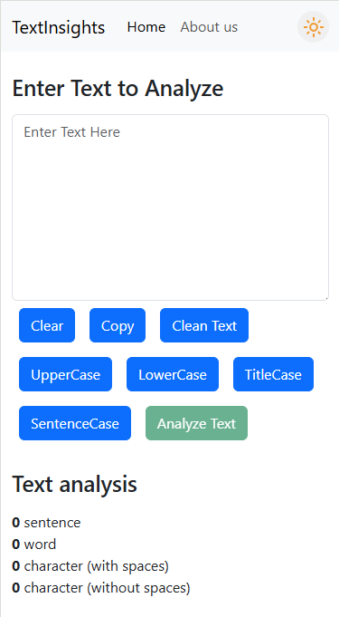

# 📝 TextInsights

**TextInsights** is a web-based text utility tool built with **React.js** and **Bootstrap 5**.  
It allows users to analyze and manipulate their text with features like **word and character counting**, **case conversion**, **tone detection**, **Reading Level Detection** — all in a responsive and modern UI.

---
- ⚠️ Note - tone detection may take some time as the render server might be waking from sleep mode.
---

## 🚀 Features

- 🔡 **Text Transformations**:
  - UPPERCASE
  - lowercase
  - Title Case
  - Sentence case
- ✂ **Clear Text**
- 📋 **Copy Text to Clipboard**
- 🔠 **Count Letters, Words, Characters**
- ⏱ **Estimate Reading Time**
- 🧠 **Tone Detection** using [Sapling.ai](https://sapling.ai/)
- 📚 **Reading Level Detection**:
  - Classifies text as *Simple*, *General Audience*, *Advanced*, or *Academic*
- 🌗 **Light/Dark Mode Toggle**

---

## 🛠 Built With

- [React.js](https://reactjs.org/)
- [Bootstrap 5](https://getbootstrap.com/)
- [Sapling.ai Tone API](https://sapling.ai/docs/api/tone)
- JavaScript (ES6+), HTML5, CSS3

---

## 📦 Installation & Setup

- ⚠️ Note - The tone detection will not work locally

To run the project locally:

### 1. Clone the repository

```bash
git clone https://github.com/Tushar-Metrani/textinsights.git
```

### 2. Navigate into the project folder

```bash
cd textinsights
```

### 3. Install dependencies

```bash
npm install
```

### 4. Start the development server

```bash
npm start
```

Visit `http://localhost:3000` (or the port your app runs on) in your browser.


## 📸 Screenshots

### 🌗 Dark Mode


### 📱 Mobile View



## 🔗 Live Demo

Check it out here 👉 [textinsights](https://tushar-metrani.github.io/textinsights/)
